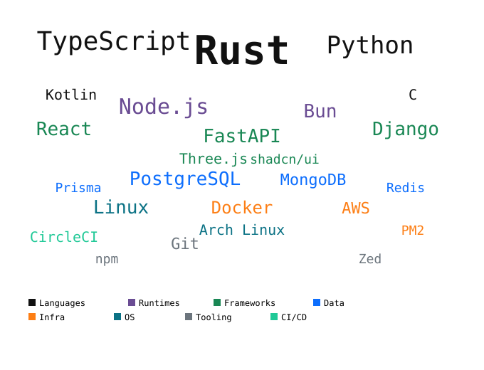

<h1 align="center">Yash Yashuday <code>// HeathKnowles</code></h1>

  <em>Full-Stack Engineer · Backend Heavy</em>

  I build end-to-end systems — from the browser to the bare metal. 
  Fascinated by low-level computing, systems design, and shipping products that actually matter. 

  
  &nbsp;
  

## About Me

| Aspect | Details |
|--------|---------|
| **Specialty** | Full-stack · Backend systems |
| **Philosophy** | Everything that matters is me, myself. |
| **Currently building** | [Peek Web Extension](https://github.com/HeathKnowles/peek) |
| **Interests** | Linux, Low-level computing |
| **Hobbies** | Reading Books, Football |

## Tech Stack

## GitHub Stats

&nbsp; &nbsp;

&nbsp; &nbsp;

## My Contributions

  

  <strong>Building in public · From bits to browsers</strong>

